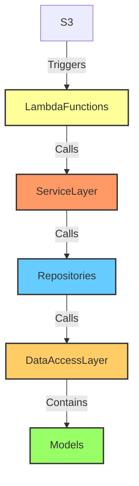

## Database Migration
### Init alembic
```powershell
 alembic init dss_db_migration
```
### Auto Generate from the available models
```powershell
 alembic revision --autogenerate -m "your message like a commit message"
```
### Upgrade Database
```powershell
 alembic upgrade head #[It will upgrade to the latest changes]
```
### Downgrade Database
```powershell
 alembic downgrade -1 #[To get to the previous version]
 alembic downgrade base #[To get to the starting point, this would !! DROP ALL THE TABLES !! if it is written in the downgrade function of the revision py file]
```
## High Level Solution Design



# Design Patterns

- [SOA - Service Oriented Architecture](https://en.wikipedia.org/wiki/Service-oriented_architecture)
- [Repository](https://martinfowler.com/eaaCatalog/repository.html)

# Resources

- [SQLAlchemy](https://www.sqlalchemy.org/)
- [Alembic](https://alembic.sqlalchemy.org/en/latest/)
