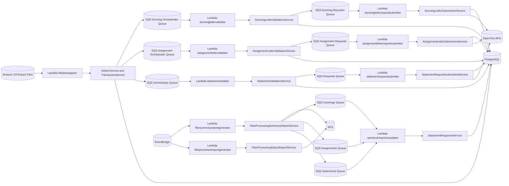
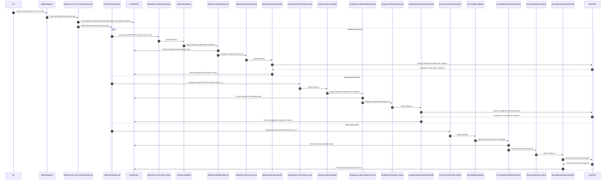

# CBIF-DSS-APP High Level Design (HLD)

## 1. Purpose
This document describes the high level design of the DSS application under src. It provides a clear view of architecture, component responsibilities, integration boundaries, runtime data flow, and non-functional design expectations.

## 2. Scope
In scope:
- File ingestion and validation for debtor and transaction extract files
- Statement, assignment letter, and dunning letter orchestration
- OpenText request submission and response update processing
- Reporting and notification workflows
- Core data persistence and repository interactions

Out of scope:
- Detailed low-level class design and per-method behavior
- Infrastructure-as-code implementation details outside current deployment configs
- UI concerns (service is backend/event driven)

## 3. Architecture Style
The solution follows a layered, event-driven architecture:
- Event sources: S3 object events and EventBridge schedules
- Compute: AWS Lambda handlers
- Domain layer: services and handler chains
- Data access: repositories and SQLAlchemy database abstraction
- Messaging: SQS queues for asynchronous pipeline stages
- Integrations: OpenText APIs, Secrets Manager, SES, SNS

## 4. System Context

## 5. Logical Component View
- Lambda entrypoints:
  - filedataingestor, statementvalidator, statementrequestsubmitter
  - assignment and dunning validator/submitter lambdas
  - filesprocessedreportgenerator, filessummaryreportgenerator, opentextresponseupdater
- Services:
  - FileReceiptService, FileValidationService, RecordValidationService
  - DebtorService, TransactionService
  - StatementValidationService, StatementRequestSubmissionService, StatementResponseService
  - Assignment and dunning orchestration/validation/submission services
  - Reporting and notification services
- Repositories:
  - Entity-specific repositories abstract DB operations
  - Run control and run batch repositories coordinate process state
- Data layer:
  - SQLAlchemy engine/session management
  - ORM models for debtor, transaction, statement, request, validations, and run metadata
- Utilities:
  - Configuration, secret manager, queue/email helpers, schema manager, common utility functions

## 6. Primary Runtime Flow (Statement, Assignment, and Dunning)

Simple flow summary:
1. A debtor or transaction file lands in S3, and filedataingestor starts parsing and validation.
2. DebtorService and TransactionService perform record-level validation and persist valid records in PostgreSQL.
3. FileProcessedService is invoked after processing and triggers orchestration.
4. FileProcessedService fans out into three parallel tracks and queues IPR chunks with run_id to statement, assignment, and dunning orchestrator queues.
5. A validator lambda for each track consumes the queue and applies generation conditions.
6. Validation results are written to PostgreSQL for traceability.
7. Eligible records are placed on the corresponding requests queue.
8. A submitter lambda per track reads requests and submits payloads to OpenText.
9. OpenText returns responses, and each submitter writes submission status back to PostgreSQL.

## 7. Assignment and Dunning Flows
- Assignment flow:
  - assignment-orchestrator queue triggers lambda_assignment_letter_validator
  - AssignmentLetterValidationService validates eligibility and logs outcomes
  - Validated requests are sent to assignment-requests queue
  - lambda_assignment_letter_request_submitter submits to OpenText and persists results
- Dunning flow:
  - dunning-orchestrator queue triggers lambda_dunning_letter_orchestrator
  - DunningLetterValidationService validates eligibility and logs outcomes
  - Validated requests are sent to dunning-requests queue
  - lambda_dunning_letter_request_submitter submits to OpenText and persists results

Both flows reuse common design patterns:
- Chain-of-responsibility for condition checks
- Repository persistence for request/validation state
- Queue-based decoupling between validation and submission stages

## 8. Lambda and Queue Inventory
The following runtime resources are included in this design.

Lambdas:
- cbif-r-euw2-lmd-dss-sftpoperation-01
- cbif-r-euw2-lmd-dss-filedataingestor-01
- cbif-r-euw2-lmd-dss-statementvalidator-01
- cbif-r-euw2-lmd-dss-statementrequestsubmitter-01
- cbif-r-euw2-lmd-dss-assignmentlettervalidator-01
- cbif-r-euw2-lmd-dss-assignmentletterrequestsubmitter-01
- cbif-r-euw2-lmd-dss-dunninglettervalidator-01
- cbif-r-euw2-lmd-dss-dunningletterrequestsubmitter-01
- cbif-r-euw2-lmd-dss-opentextresponseupdater-01
- cbif-r-euw2-lmd-dss-filesprocessedreportgenerator-01
- cbif-r-euw2-lmd-dss-filessummaryreportgenerator-01
- cbif-r-euw2-lmd-dss-dssdboperation-01

Queues:
- cbif-r-euw2-sqs-dss-orchestrator-01
- cbif-r-euw2-sqs-dss-orchestrator-01-dead-letter
- cbif-r-euw2-sqs-dss-requests-01
- cbif-r-euw2-sqs-dss-requests-01-dead-letter
- cbif-r-euw2-sqs-dss-statements-01
- cbif-r-euw2-sqs-dss-statements-01-dead-letter
- cbif-r-euw2-sqs-dss-assignment-orchestrator-01
- cbif-r-euw2-sqs-dss-assignment-orchestrator-01-dead-letter
- cbif-r-euw2-sqs-dss-assignment-requests-01
- cbif-r-euw2-sqs-dss-assignment-requests-01-dead-letter
- cbif-r-euw2-sqs-dss-assignments-01
- cbif-r-euw2-sqs-dss-assignments-01-dead-letter
- cbif-r-euw2-sqs-dss-dunning-orchestrator-01
- cbif-r-euw2-sqs-dss-dunning-orchestrator-01-dead-letter
- cbif-r-euw2-sqs-dss-dunning-requests-01
- cbif-r-euw2-sqs-dss-dunning-requests-01-dead-letter
- cbif-r-euw2-sqs-dss-dunnings-01
- cbif-r-euw2-sqs-dss-dunnings-01-dead-letter

## 9. Data and State Management
- Primary datastore: PostgreSQL
- State entities include:
  - RunControl and RunBatch for processing lifecycle
  - Debtor and Transaction for canonical ingested records
  - Statement, AssignmentLetter, DunningLetter and their request entities
  - Validation entities for auditability and traceability
- Processing model:
  - File-level checks gate processing
  - Record-level checks isolate invalid items
  - Per-IPR outcomes are logged and persisted

## 10. Deployment View
- Packaging and deployment configuration is defined in deployment/deployment.config.json
- Codebase is organized so common modules can be packaged as layers:
  - repositories
  - data_access_layer
  - services
  - utilities
- Runtime target: Python 3.11 Lambda functions and layers
- Local execution and integration testing rely on LocalStack and local Postgres setup

## 11. Security and Compliance Design
- Secret material and endpoint details are resolved via configuration and secrets abstraction
- Sensitive integration credentials are externalized (not hardcoded in service flow)
- Service-to-service communication uses AWS managed channels (SQS/EventBridge)
- Validation and processing logs provide business traceability for audit support

## 12. Reliability and Scalability Design
- Asynchronous queue boundaries allow horizontal scaling of processing stages
- Idempotent-style upsert patterns reduce duplicate processing impact
- Segmented lambdas isolate failures to a processing stage
- Scheduled reporting gives operational visibility into lag/backlog states

## 13. Observability Design
- Current observability includes log outputs and persistence of validation/report states
- Recommended operational baselines:
  - Queue depth alarms per queue
  - Lambda error and duration alarms
  - DB connection and failed transaction monitoring
  - End-to-end SLA metrics from file arrival to final update

## 14. Known Design Risks
- Full table replacement patterns in some ingestion paths can increase data-loss risk during partial failures
- Broad exception handling in selected modules can hide root causes
- Unit test coverage is currently narrow compared to system breadth

## 15. HLD Decision Summary
- Event-driven asynchronous architecture is retained as the core system pattern
- Layered service and repository model is retained for maintainability
- Validation chain handlers are retained for business-rule extensibility
- Next iteration should prioritize resilience hardening and broader automated test coverage

## 16. References
- src/diagrams/architecture.md
- src/deployment/deployment.config.json
- src/services
- src/repositories
- src/data_access_layer
