# CBIF-DSS-APP Architecture (As-Is)

## 1) Purpose and scope
This document describes the current runtime architecture of the Python codebase under `src`, focused on:
- File ingestion and validation
- Debtor/transaction persistence
- Statement, assignment letter, and dunning letter orchestration
- OpenText submission and response handling
- Operational reporting

## 2) Architecture style
The solution follows a layered, event-driven style:
- **Compute**: AWS Lambda functions
- **Messaging**: Amazon S3 event + Amazon SQS queues + EventBridge schedules
- **Domain logic**: service layer in `services`
- **Data access**: repository layer in `repositories`
- **Persistence**: PostgreSQL via SQLAlchemy in `data_access_layer`
- **Integrations**: OpenText HTTP APIs, AWS Secrets Manager, SNS/SES

## 3) System context
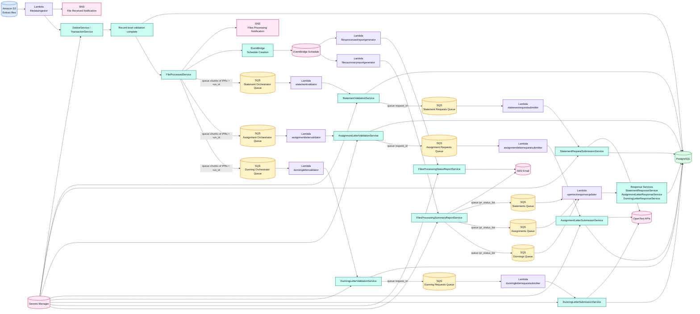

## 4) Code-level layered view
```mermaid
flowchart TB
    subgraph Lambda Entrypoints
      LF1[filedataingestor.py]
      LF2[statementvalidator.py]
      LF3[statementrequestsubmitter.py]
      LF4[assignmentlettervalidator.py]
      LF5[assignmentletterrequestsubmitter.py]
      LF6[dunninglettervalidator.py]
      LF7[dunningletterrequestsubmitter.py]
      LF8[opentextresponseupdater.py]
      LF9[filesprocessedreportgenerator.py]
      LF10[filessummaryreportgenerator.py]
      LF11[sftpoperation.py]
      LF12[dssdboperation.py]
    end

    subgraph Services
      S1[FileReceiptService]
      S2[FileValidationService]
      S3[RecordValidationService]
      S4[DebtorService]
      S5[TransactionService]
      S6[FileProcessedService]
      S7[StatementOrchestrationService]
      S8[AssignmentLetterOrchestrationService]
      S9[DunningLetterOrchestrationService]
      S10[StatementValidationService]
      S11[AssignmentLetterValidationService]
      S12[DunningLetterValidationService]
      S13[StatementRequestSubmissionService]
      S14[AssignmentLetterSubmissionService]
      S15[DunningLetterSubmissionService]
      S16[StatementResponseService]
      S17[AssignmentLetterResponseService]
      S18[DunningLetterResponseService]
      S19[FilesProcessingStatusReportService]
      S20[FilesProcessingSummaryReportService]
      S21[NotificationService]
      S22[FilesProcessingStatusReportSchedulerService]
    end

    subgraph Queues
      Q1[Statement Orchestrator Queue]
      Q2[Assignment Orchestrator Queue]
      Q3[Dunning Orchestrator Queue]
      Q4[Statement Requests Queue]
      Q5[Assignment Requests Queue]
      Q6[Dunning Requests Queue]
      Q7[Statements Queue]
      Q8[Assignments Queue]
      Q9[Dunnings Queue]
    end

    subgraph Repositories
      R1[RunControlRepository]
      R2[RunBatchRepository]
      R3[DebtorRepository]
      R4[TransactionRepository]
      R5[StatementRepository]
      R6[StatementRequestRepository]
      R7[AssignmentLetterRepository]
      R8[AssignmentLetterRequestRepository]
      R9[DunningLetterRepository]
      R10[DunningLetterRequestRepository]
    end

    subgraph DataAccess
      D1["Database: SQLAlchemy Engine and Session"]
      D2["ORM Models\nDebtor, Transaction, Statement,\nStatementRequest, RunControl, RunBatch, ..."]
    end

    subgraph Utilities
      U1[Configuration]
      U2[SecretManager]
      U3["SQS, SNS, SES Helpers"]
      U4["SchemaManager and FixedLengthFileReader"]
      U5[Utility]
    end

    LF1 --> S1 --> S4
    LF1 --> S1 --> S5
    S4 --> S6
    S5 --> S6

    S6 --> S7 --> Q1 --> LF2 --> S10 --> Q4 --> LF3 --> S13
    S6 --> S8 --> Q2 --> LF4 --> S11 --> Q5 --> LF5 --> S14
    S6 --> S9 --> Q3 --> LF6 --> S12 --> Q6 --> LF7 --> S15

    S20 --> Q7 --> LF8 --> S16
    S20 --> Q8 --> LF8 --> S17
    S20 --> Q9 --> LF8 --> S18

    LF9 --> S19 --> S21
    LF10 --> S20 --> S21
    S6 --> S22 --> U5
    LF11 --> U7
    LF12 --> D1

    S4 --> S2
    S4 --> S3
    S5 --> S2
    S5 --> S3

    S4 --> R3
    S5 --> R4
    S6 --> R1
    S6 --> R2
    S10 --> R5
    S10 --> R6
    S11 --> R7
    S11 --> R8
    S12 --> R9
    S12 --> R10
    S13 --> R5
    S13 --> R6
    S14 --> R7
    S14 --> R8
    S15 --> R9
    S15 --> R10
    S16 --> R5
    S17 --> R7
    S18 --> R9
    S19 --> R5
    S20 --> R5

    R1 --> D1
    R2 --> D1
    R3 --> D1
    R4 --> D1
    R5 --> D1
    R6 --> D1
    R7 --> D1
    R8 --> D1
    R9 --> D1
    R10 --> D1
    D1 --> D2

    S1 --> U1
    S13 --> U2
    S14 --> U2
    S15 --> U2
    S19 --> U2
    S20 --> U2
    S6 --> U3
    S21 --> U3
    S2 --> U4
    S4 --> U5

    classDef entry fill:#EDE9FE,stroke:#7C3AED,color:#111827,stroke-width:1.5px;
    classDef svc fill:#CCFBF1,stroke:#0F766E,color:#0F172A,stroke-width:1.5px;
    classDef queue fill:#FEF3C7,stroke:#D97706,color:#111827,stroke-width:1.5px;
    classDef repo fill:#DBEAFE,stroke:#2563EB,color:#0F172A,stroke-width:1.5px;
    classDef dal fill:#DCFCE7,stroke:#15803D,color:#111827,stroke-width:1.5px;
    classDef util fill:#FEF3C7,stroke:#D97706,color:#111827,stroke-width:1.5px;

    class LF1,LF2,LF3,LF4,LF5,LF6,LF7,LF8,LF9,LF10,LF11,LF12 entry;
    class S1,S2,S3,S4,S5,S6,S7,S8,S9,S10,S11,S12,S13,S14,S15,S16,S17,S18,S19,S20,S21,S22 svc;
    class Q1,Q2,Q3,Q4,Q5,Q6,Q7,Q8,Q9 queue;
    class R1,R2,R3,R4,R5,R6,R7,R8,R9,R10 repo;
    class D1,D2 dal;
    class U1,U2,U3,U4,U5,U6,U7 util;
```

## 5) End-to-end processing sequence
```mermaid
sequenceDiagram
    autonumber
    participant S3 as Amazon S3
    participant LI as Lambda filedataingestor
    participant FS as DebtorService/TransactionService
    participant SNS as SNS
    participant FP as FileProcessedService
    participant QSO as SQS Statement Orchestrator Queue
    participant QAO as SQS Assignment Orchestrator Queue
    participant QDO as SQS Dunning Orchestrator Queue
    participant DB as PostgreSQL
    participant LVS as Lambda statementvalidator
    participant SVS as StatementValidationService
    participant QSR as SQS Statement Requests Queue
    participant LSS as Lambda statementrequestsubmitter
    participant SSS as StatementRequestSubmissionService
    participant LVA as Lambda assignmentlettervalidator
    participant SVA as AssignmentLetterValidationService
    participant QAR as SQS Assignment Requests Queue
    participant LSA as Lambda assignmentletterrequestsubmitter
    participant SSA as AssignmentLetterSubmissionService
    participant LVD as Lambda dunninglettervalidator
    participant SVD as DunningLetterValidationService
    participant QDR as SQS Dunning Requests Queue
    participant LSD as Lambda dunningletterrequestsubmitter
    participant SSD as DunningLetterSubmissionService
    participant OT as OpenText
    participant EB as EventBridge
    participant LR as Report Lambdas
    participant Q3 as SQS Statements Queue
    participant Q4 as SQS Assignments Queue
    participant Q5 as SQS Dunnings Queue
    participant LU as Lambda opentextresponseupdater
    participant RS as Response Services

    S3->>LI: [1] ObjectCreated event (A* / B* extract file)
    LI->>SNS: [2] Notify file received (processing will start shortly)
    LI->>FS: [3] Parse + process records
    FS->>DB: [3] Persist Debtor/Transaction + RunControl/RunBatch
    FS->>FP: [4] Notify file processed for orchestration
    FP->>SNS: [5] Notify files are being processed
    FP->>EB: [6] Schedule processing status + summary report jobs

    par Statement branch
      FP->>QSO: [7] Queue statement IPR chunks with run_id
      QSO->>LVS: [8] Deliver chunk messages
      LVS->>SVS: [8] Validate statement conditions
      SVS->>DB: [9] Persist statement validation logs
      SVS->>QSR: [10] Queue statement request_id
      QSR->>LSS: [11] Deliver request_id
      LSS->>SSS: [11] Submit request body
      SSS->>OT: [11] Auth + submit statement payload
      OT-->>SSS: [12] Statement submission result
      SSS->>DB: [12] Update statement submission fields
    and Assignment branch
      FP->>QAO: [7] Queue assignment IPR chunks with run_id
      QAO->>LVA: [8] Deliver chunk messages
      LVA->>SVA: [8] Validate assignment conditions
      SVA->>DB: [9] Persist assignment validation logs
      SVA->>QAR: [10] Queue assignment request_id
      QAR->>LSA: [11] Deliver request_id
      LSA->>SSA: [11] Submit request body
      SSA->>OT: [11] Auth + submit assignment payload
      OT-->>SSA: [12] Assignment submission result
      SSA->>DB: [12] Update assignment submission fields
    and Dunning branch
      FP->>QDO: [7] Queue dunning IPR chunks with run_id
      QDO->>LVD: [8] Deliver chunk messages
      LVD->>SVD: [8] Validate dunning conditions
      SVD->>DB: [9] Persist dunning validation logs
      SVD->>QDR: [10] Queue dunning request_id
      QDR->>LSD: [11] Deliver request_id
      LSD->>SSD: [11] Submit request body
      SSD->>OT: [11] Auth + submit dunning payload
      OT-->>SSD: [12] Dunning submission result
      SSD->>DB: [12] Update dunning submission fields
    end

    EB->>LR: Periodic trigger (status/summary)
    LR->>DB: Read progress and logs
    LR->>OT: Query processing status / totals
    LR->>Q3: Queue statement IPR status chunks
    LR->>Q4: Queue assignment IPR status chunks
    LR->>Q5: Queue dunning IPR status chunks

    Q3->>LU: Deliver statement IPR status list
    Q4->>LU: Deliver assignment IPR status list
    Q5->>LU: Deliver dunning IPR status list
    LU->>RS: Route by document_type
    RS->>DB: Update final statement/assignment/dunning processing status
```

## 6) Domain/data model map
```mermaid
classDiagram
    class RunControl
    class RunBatch
    class Debtor
    class Transaction
    class DebtorFileValidation
    class TransactionFileValidation
    class DebtorRecordValidation
    class TransactionRecordValidation
  class FileValidationRule
  class RecordValidationRule

    class StatementValidation
    class StatementRequest
    class Statement

  class AssignmentLetterValidation
  class AssignmentLetterRequest
  class AssignmentLetter

  class DunningLetterValidation
  class DunningLetterRequest
  class DunningLetter

    RunControl "1" --> "0..*" Debtor : run_id
    RunControl "1" --> "0..*" Transaction : run_id
    Debtor "1" --> "0..*" Transaction : IPR

    RunControl "1" --> "0..*" DebtorFileValidation
    RunControl "1" --> "0..*" TransactionFileValidation
    RunControl "1" --> "0..*" DebtorRecordValidation
    RunControl "1" --> "0..*" TransactionRecordValidation

    StatementRequest "1" --> "0..*" Statement : StatementRequestId
    RunControl "1" --> "0..*" Statement : RunId
    RunControl "1" --> "0..*" StatementValidation : RunId

  AssignmentLetterRequest "1" --> "0..*" AssignmentLetter : AssignmentLetterRequestID
  RunControl "1" --> "0..*" AssignmentLetter : RunId
  RunControl "1" --> "0..*" AssignmentLetterValidation : RunId

  DunningLetterRequest "1" --> "0..*" DunningLetter : DunningLetterRequestID
  RunControl "1" --> "0..*" DunningLetter : RunId
  RunControl "1" --> "0..*" DunningLetterValidation : RunId

  FileValidationRule "1" --> "0..*" DebtorFileValidation : ConditionName
  FileValidationRule "1" --> "0..*" TransactionFileValidation : ConditionName
  RecordValidationRule "1" --> "0..*" DebtorRecordValidation : ConditionName
  RecordValidationRule "1" --> "0..*" TransactionRecordValidation : ConditionName
```

## 7) Validation pipelines (chain-of-responsibility)
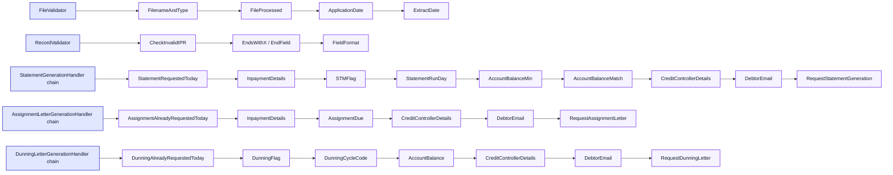

## 8) Deployment/build packaging view
```mermaid
flowchart TD
    A[deployment/deployment.config.json] --> B[deployment/package.py]
    B --> C1[Zip Lambda functions]
    B --> C2[Zip Lambda layers]
    C1 --> D[src/artifacts/*/*.zip]
    C2 --> D

    C1 --> F1[lambda_db_operation]
    C1 --> F2[lambda_file_data_ingestor]
    C1 --> F3[lambda_statement_validator]
    C1 --> F4[lambda_statement_request_submitter]
    C1 --> F5[lambda_assignment_letter_validator]
    C1 --> F6[lambda_assignment_letter_request_submitter]
    C1 --> F7[lambda_dunning_letter_validator]
    C1 --> F8[lambda_dunning_letter_request_submitter]
    C1 --> F9[lambda_opentextresponseupdater]
    C1 --> F10[lambda_extract_files_*_report]

    C2 --> L1[external_packages layer]
    C2 --> L2[repositories layer]
    C2 --> L3[data_access_layer layer]
    C2 --> L4[services layer]
    C2 --> L5[utilities layer]

    classDef cfg fill:#E0F2FE,stroke:#0284C7,color:#0F172A,stroke-width:1.5px;
    classDef process fill:#EDE9FE,stroke:#7C3AED,color:#111827,stroke-width:1.5px;
    classDef output fill:#DCFCE7,stroke:#16A34A,color:#111827,stroke-width:1.5px;
    classDef target fill:#FEF3C7,stroke:#D97706,color:#111827,stroke-width:1.5px;

    class A cfg;
    class B,C1,C2 process;
    class D output;
    class F1,F2,F3,F4,F5,F6,F7,F8,F9,F10,L1,L2,L3,L4,L5 target;
```

## 9) Key architectural observations
1. The architecture is strongly **event-driven** and decoupled through SQS and scheduled jobs.
2. The domain flow is **batch-oriented** (daily extract files and run/submission IDs).
3. Data access is centralized through `Database` + repository classes.
4. Validation logic is modeled as **chain-of-responsibility**, allowing condition ordering via config.
5. OpenText integration is asynchronous from ingestion across statement, assignment, and dunning tracks, improving throughput and fault isolation.
6. `opentextresponseupdater` routes updates by `document_type` to statement, assignment, and dunning response services.

## 10) Failure mode sequences

### 10.1 OpenText timeout during request submission
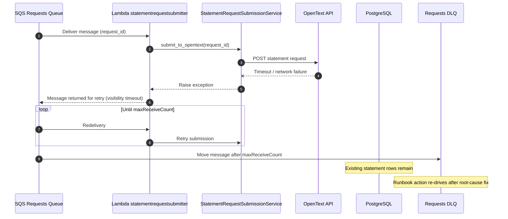

### 10.2 Partial submission from OpenText
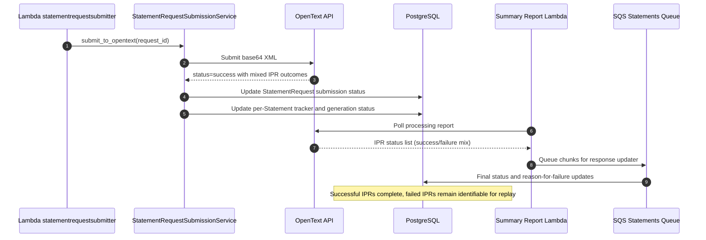

### 10.3 Dead-letter handling and re-drive
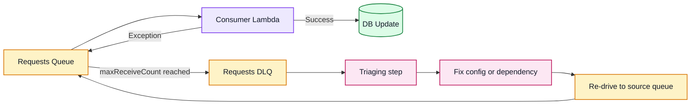

## 11) Data retention and replay strategy (RunControl / RunBatch lifecycle)

### 11.1 Lifecycle model
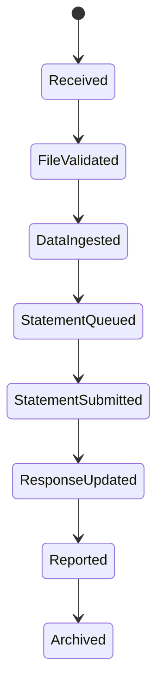

### 11.2 Entity lifecycle intent
- **RunControl**: canonical record for one intake day/file pair and processing flags.
- **RunBatch**: transient helper state used when files arrive out of order or were previously processed.
- **StatementRequest / Statement / Validation logs**: auditable trace for submission and final processing state.

### 11.3 Retention policy (recommended baseline)
- Keep **RunControl, StatementRequest, Statement** for **180 days**.
- Keep **validation log tables** for **90 days** for operational analysis.
- Keep **RunBatch** for **7 days** (transient orchestration support).
- Keep **generated reports** for **90 days** in immutable storage.

### 11.4 Replay strategy
1. Identify replay scope by `submission_id`, file name, and failed IPR list.
2. Classify replay type:
   - **Type A**: submit-only replay (OpenText timeout or transient API failure).
   - **Type B**: response-update replay (missed or failed updater processing).
   - **Type C**: full ingestion replay (source-file correction required).
3. Preserve audit trail; do not hard-delete statement history for replayed runs.
4. Use new replay marker (for example `ReplayOfSubmissionId`) to link old/new runs.
5. Re-drive messages from DLQ or re-queue targeted payloads by chunk.

### 11.5 Replay guardrails
- Replays must be **idempotent** at statement level (`StatementRequestId`, `OpenTextIPR`).
- Do not replay while source queues are in sustained high backlog.
- Pause scheduled summary notifications if replay is expected to change final counts.

## 12) Operational runbook

### 12.1 Queue depth thresholds
| Queue | Green | Amber | Red | Action |
|---|---:|---:|---:|---|
| Orchestrator Queue | < 100 | 100 to 1000 | > 1000 | Scale consumer concurrency, inspect validation latency |
| Requests Queue | < 50 | 50 to 500 | > 500 | Check OpenText latency, auth failures, timeout spikes |
| Statements Queue | < 100 | 100 to 1000 | > 1000 | Check summary generator and response updater health |
| Any DLQ | 0 | 1 to 10 | > 10 | Stop re-drive, triage root cause, then controlled re-drive |

### 12.2 Report expectations
- **Files Processing Status Report**: generated on processing interval; should stop once request queue drains.
- **Files Processing Summary Report**: generated on summary interval; expected when OpenText total processed reaches AWS expected count.
- If reports continue for more than 2 cycles after queue drain, investigate scheduler rule cleanup.

### 12.3 Retry behavior matrix
| Component | Retry trigger | Retry mechanism | Stop condition | Escalation |
|---|---|---|---|---|
| statementrequestsubmitter | OpenText timeout/5xx | Lambda retry via SQS redelivery | maxReceiveCount then DLQ | API owner + platform on-call |
| statementvalidator | transient DB or parse failures | SQS redelivery | maxReceiveCount then DLQ | Data pipeline owner |
| opentextresponseupdater | DB update failure | SQS redelivery | maxReceiveCount then DLQ | DB/platform owner |
| summary/status report lambdas | API unavailability | next EventBridge interval | manual disable or timeout policy | Operations lead |

### 12.4 Incident playbook (quick steps)
1. Check queue depths and DLQ counts first.
2. Correlate with OpenText API health and timeout rate.
3. Validate secrets and endpoint configuration.
4. Re-drive only after the failure cause is fixed.
5. Confirm report reconciliation: expected statements vs processed statements.
6. Close incident with replay audit (scope, count, outcome).

## 13) End-to-end flow diagram
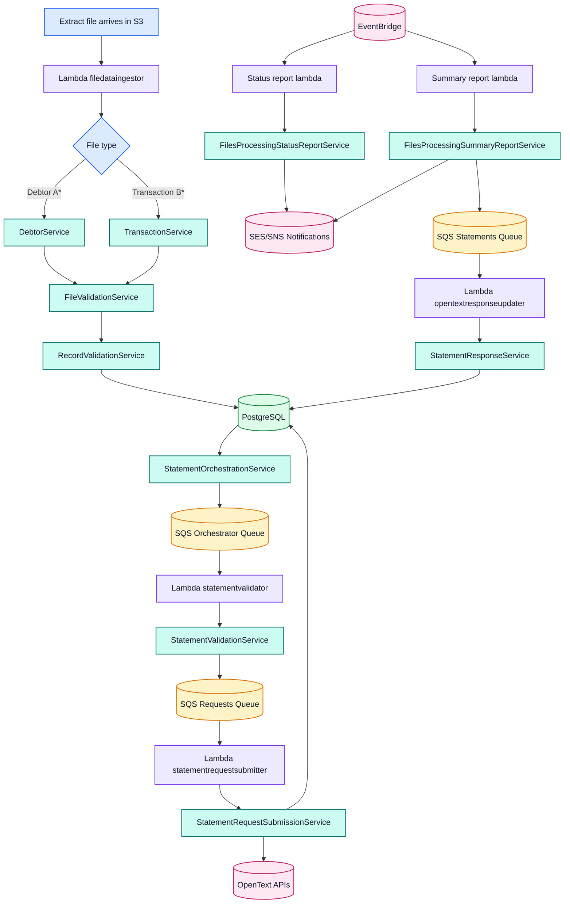

## 14) Assignment letter generation architecture

### 14.1 Assignment letter flow diagram
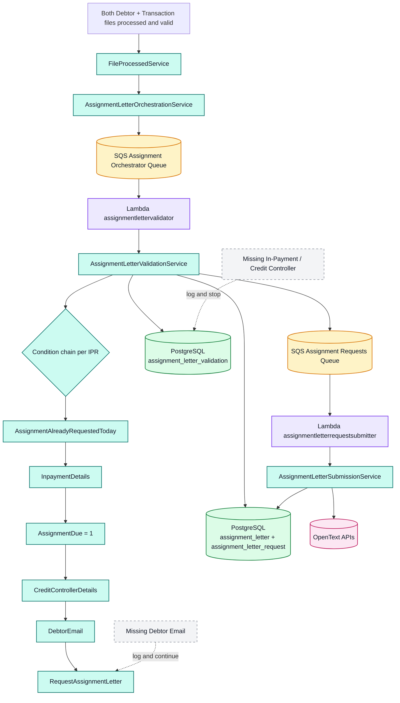

### 14.2 Assignment letter component diagram
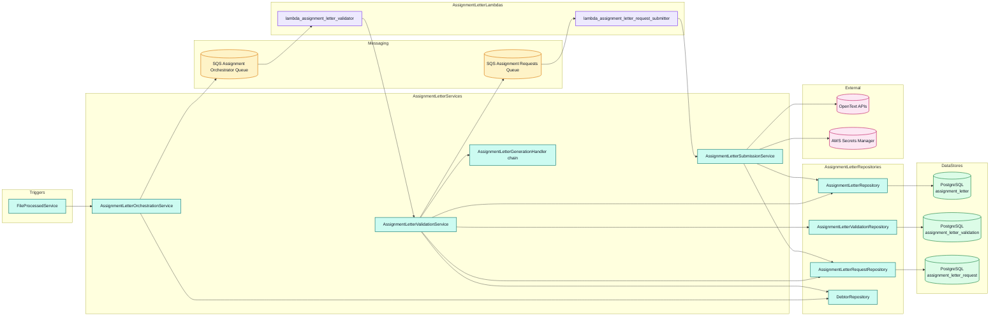

### 14.3 Notes
- Assignment letters are processed independently from statement and dunning flows.
- `DebtorEmail` is a non-blocking condition (log and continue).
- `InpaymentDetails` and `CreditControllerDetails` are blocking conditions (log and stop).
- `AssignmentDue` false is a silent stop (no log), per DSS-491 acceptance criteria.

## 15) Dunning letter generation architecture

### 15.1 Dunning letter flow diagram
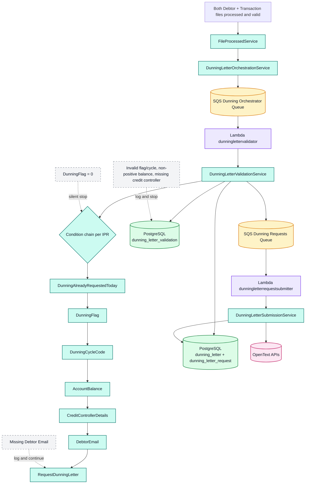

### 15.2 Dunning letter component diagram
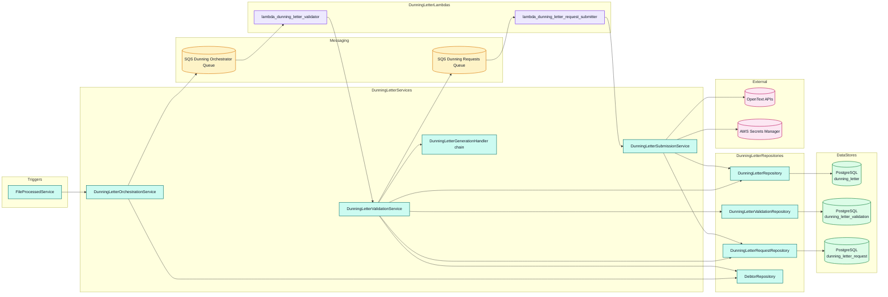

### 15.3 Notes
- Dunning letters are processed independently from statement and assignment flows.
- `DunningFlag = 0` is a silent stop (no log).
- Invalid dunning flag/cycle, non-positive account balance, or missing credit controller are blocking conditions (log and stop).
- `DebtorEmail` is a non-blocking condition (log and continue).
