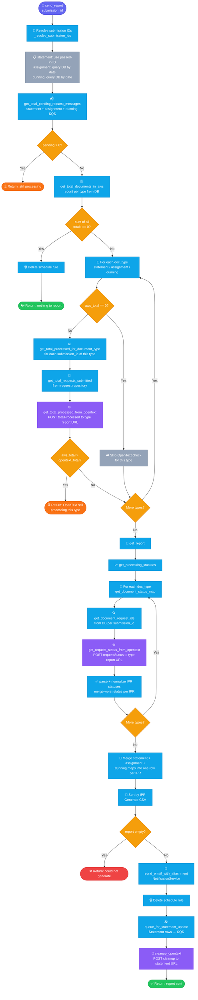

# Files Processing Summary Report Service — Flow Diagram

```mermaid
flowchart TD
    A([🚀 send_report\nsubmission_id]) --> B[🔑 Resolve submission IDs\n_resolve_submission_ids]
    B --> B1[📋 statement: use passed-in ID\nassignment: query DB by date\ndunning: query DB by date]
    B1 --> C[📬 get_total_pending_request_messages\nstatement + assignment + dunning SQS]
    C --> D{pending > 0?}
    D -- Yes --> E([⏳ Return: still processing])
    D -- No --> F[🗄️ get_total_documents_in_aws\ncount per type from DB]
    F --> G{sum of all\ntotals == 0?}
    G -- Yes --> H[🗑️ Delete schedule rule]
    H --> I([📭 Return: nothing to report])
    G -- No --> J[🔁 For each doc_type\nstatement / assignment / dunning]
    J --> K{aws_total == 0?}
    K -- Yes --> L[⏭️ Skip OpenText check\nfor this type]
    K -- No --> M[📊 get_total_processed_for_document_type\nfor each submission_id of this type]
    M --> M1[🔢 get_total_requests_submitted\nfrom request repository]
    M1 --> M2[🌐 get_total_processed_from_opentext\nPOST totalProcessed to type report URL]
    M2 --> N{aws_total >\nopentext_total?}
    N -- Yes --> O([⏳ Return: OpenText still\nprocessing this type])
    N -- No --> P{More types?}
    L --> P
    P -- Yes --> J
    P -- No --> Q[📝 get_report]

    Q --> Q1[📈 get_processing_statuses]
    Q1 --> Q2[🔁 For each doc_type\nget_document_status_map]
    Q2 --> Q3[🔍 get_document_request_ids\nfrom DB per submission_id]
    Q3 --> Q4[🌐 get_request_status_from_opentext\nPOST requestStatus to type report URL]
    Q4 --> Q5[✅ parse + normalize IPR statuses\nmerge worst-status per IPR]
    Q5 --> Q6{More types?}
    Q6 -- Yes --> Q2
    Q6 -- No --> Q7[🔀 Merge statement + assignment +\ndunning maps into one row per IPR]
    Q7 --> Q8[📄 Sort by IPR\nGenerate CSV]

    Q8 --> R{report empty?}
    R -- Yes --> S([❌ Return: could not generate])
    R -- No --> T[📧 send_email_with_attachment\nNotificationService]
    T --> U[🗑️ Delete schedule rule]
    U --> V[📤 queue_for_statement_update\nStatement rows → SQS]
    V --> W[🧹 cleanup_opentext\nPOST cleanup to statement URL]
    W --> X([✅ Return: report sent])

    classDef entry fill:#6366f1,stroke:#4338ca,color:#fff,rx:20
    classDef process fill:#0ea5e9,stroke:#0284c7,color:#fff
    classDef decision fill:#f59e0b,stroke:#d97706,color:#fff
    classDef returnOk fill:#22c55e,stroke:#16a34a,color:#fff,rx:20
    classDef returnWait fill:#f97316,stroke:#ea580c,color:#fff,rx:20
    classDef returnErr fill:#ef4444,stroke:#dc2626,color:#fff,rx:20
    classDef opentext fill:#8b5cf6,stroke:#7c3aed,color:#fff
    classDef db fill:#14b8a6,stroke:#0d9488,color:#fff
    classDef skip fill:#94a3b8,stroke:#64748b,color:#fff

    class A entry
    class B,B1,C,F,J,M,M1,Q,Q1,Q2,Q3,Q5,Q7,Q8,H,T,U,V process
    class D,G,K,N,P,Q6,R decision
    class X,I returnOk
    class E,O returnWait
    class S returnErr
    class M2,Q4,W opentext
    class L,B1 skip
```
