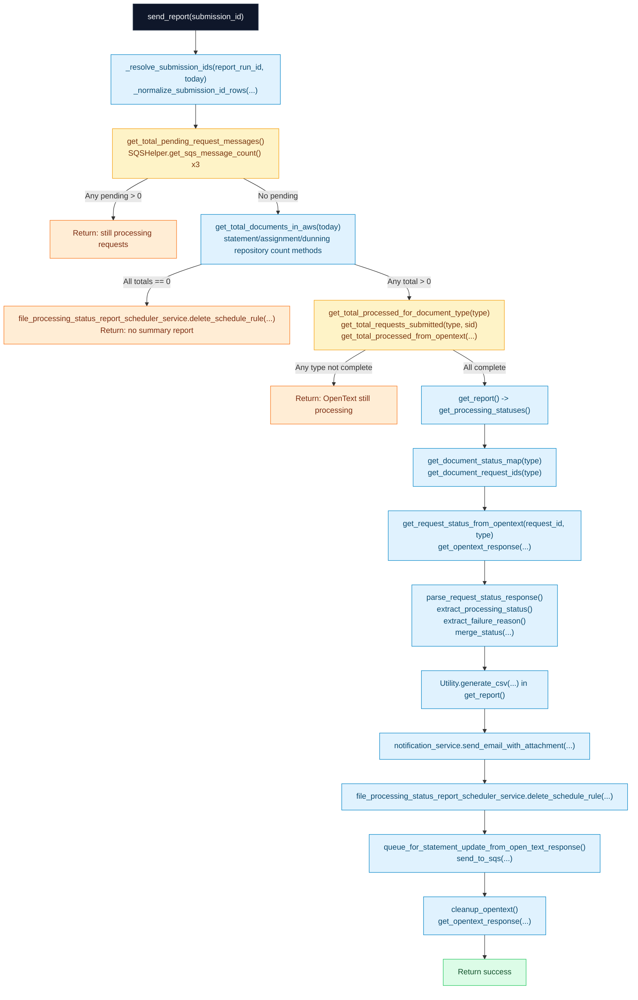

# Files Processing Summary Report Service – Flow

This document explains how `FilesProcessingSummaryReportService` works end-to-end.

## Purpose

`FilesProcessingSummaryReportService` generates and emails the daily consolidated CSV summary for:
- statements
- assignment letters
- dunning letters

It also:
- waits for request queues to drain
- checks OpenText processing completion
- fetches per-request status from OpenText
- queues statement updates back to SQS
- triggers OpenText cleanup

---

## High-level flow

1. `send_report(submission_id)` starts.
2. It resolves submission IDs by type (`statement`, `assignment`, `dunning`).
3. It checks pending SQS request messages for all three types.
   - If any are pending, it returns early.
4. It calculates total documents in AWS (by type).
   - Uses date+submission matching first.
   - Falls back to submission-only counting when date filter returns zero.
5. If total documents are zero, it deletes the summary scheduler and exits.
6. For each type with AWS records, it checks OpenText `totalProcessed`.
   - If OpenText hasn’t caught up, it returns early.
7. When all complete, it builds consolidated status data:
   - Finds request IDs for each type
   - Calls OpenText `requestStatus`
   - Normalizes status + failure reason
   - Merges into one row per IPR
8. Generates CSV and sends email.
9. Deletes summary scheduler rule.
10. Queues statement update messages (statement status only) to statements SQS.
11. Calls OpenText cleanup request.
12. Returns success message.

---

## Mermaid flowchart

---

## Key decision points

- Queue guard: summary only starts when all request queues are empty.
- AWS totals guard: if no records exist, summary is skipped.
- OpenText completion guard: summary waits until OpenText processed totals match.
- Type-specific handling:
  - statement rows are also queued for post-processing update.
  - assignment/dunning are included in CSV but not sent to statement update queue.

---

## Key methods involved

- `send_report()`
- `_resolve_submission_ids()`
- `get_total_pending_request_messages()`
- `get_total_documents_in_aws()`
- `get_total_processed_for_document_type()`
- `get_total_processed_from_opentext()`
- `get_processing_statuses()`
- `get_document_request_ids()`
- `get_request_status_from_opentext()`
- `parse_request_status_response()`
- `queue_for_statement_update_from_open_text_response()`
- `cleanup_opentext()`
